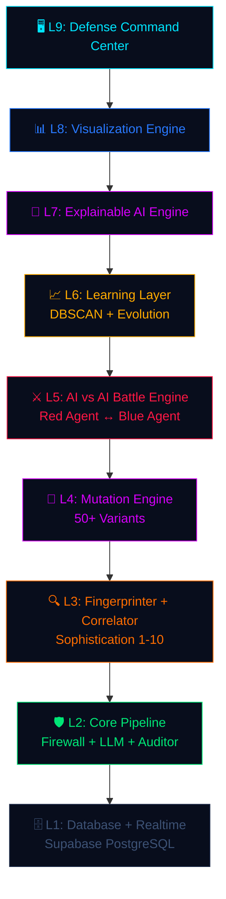

# ⚔ ARGUS-X — The AI That Defends AI

<div align="center">

**Autonomous AI Defense Operating System**

*Not a firewall. An immune system.*

[](https://python.org)
[](https://fastapi.tiangolo.com)
[](https://supabase.com)
[](https://onnxruntime.ai)
[](https://railway.app)

</div>

---

## The Problem

Every company is rushing to deploy AI. **None of them are securing it.**

An attacker sends one message, and the AI does whatever they say — leaks data, ignores policies, reveals system instructions. Current solutions are static regex rules that haven't evolved since 2023.

## What Makes ARGUS-X Different

| Capability | Typical LLM Firewall | ARGUS-X |
|---|---|---|
| Attack detection | ✅ Basic regex | ✅ Regex + ML + Heuristics |
| Explainability | ❌ Black box | ✅ Full XAI per decision |
| Self-improvement | ❌ Static | ✅ Autonomous red team loop |
| Variant pre-blocking | ❌ None | ✅ 50+ per attack |
| Campaign detection | ❌ None | ✅ Cross-session correlator |
| Evolution tracking | ❌ None | ✅ DBSCAN + trend analysis |
| AI vs AI battle | ❌ None | ✅ Live simulation (5 tiers) |
| Defense Command Center | ❌ None | ✅ Layer 9 unified view |

## Architecture — 9 Defense Layers



## Quick Start

### Prerequisites
- Python 3.11+
- Supabase project (with schema v3 applied)
- API key for Claude/GPT (optional — runs in mock mode without)

### Setup
```bash
git clone https://github.com/neurodermai/ARGUS_X.git
cd ARGUS_X/argus/backend

python -m venv venv
source venv/bin/activate
pip install -r requirements.txt

cp .env.example .env
# Edit .env with your Supabase credentials

python main.py
# Dashboard: http://localhost:8000/
# API docs: http://localhost:8000/docs
```

### Seed Demo Data
```bash
python scripts/seed_demo.py --count 40
```

## API Endpoints

| Method | Endpoint | Description |
|---|---|---|
| `GET` | `/health` | System health + all 9 layer states |
| `POST` | `/api/v1/chat` | Full 9-layer security pipeline |
| `POST` | `/api/v1/redteam` | Manual attack testing |
| `GET` | `/api/v1/analytics/stats` | Live statistics + agent + evolution |
| `GET` | `/api/v1/analytics/logs` | Recent event history |
| `GET` | `/api/v1/xai/decisions` | XAI reasoning decisions |
| `GET` | `/api/v1/battle/state` | AI vs AI battle state |
| `GET` | `/api/v1/battle/history` | Battle tick history |
| `GET/POST` | `/api/v1/agents/*` | Red agent status/pause/resume/cycle |
| `GET` | `/api/v1/clusters` | DBSCAN threat cluster summary |
| `GET` | `/api/v1/evolution` | Sophistication evolution report |
| `GET` | `/api/v1/campaigns` | Active campaign alerts |
| `WS` | `/ws/live` | Real-time event stream |

## Tech Stack

- **Backend**: Python 3.11 + FastAPI + Uvicorn
- **Database**: Supabase PostgreSQL + Realtime
- **ML**: ONNX Runtime (DistilBERT, CPU-only, 25ms inference)
- **LLM**: LiteLLM → Claude/GPT/Ollama/Mock
- **NLP**: Sentence-Transformers (MiniLM-L6-v2)
- **Frontend**: Vanilla HTML/CSS/JS + Canvas API
- **Deployment**: Railway + Vercel

## Defense Command Center

The Layer 9 visualization renders all 8 layers simultaneously:

- **Neural Threat Map** — Canvas particles showing attacks hitting the defense core
- **XAI Decision Stream** — Per-decision reasoning cards with layer confidence bars
- **AI vs AI Battle** — Live red/blue agent stats with block rate
- **Defense Log** — Color-coded scrolling log
- **Analytics Stack** — Threat level, sophistication trend, cluster map, latency

## How It Works

```
User Message → Session Assessment → Regex (0ms) → ML (25ms) → LLM → Output Audit
                                        ↓                          ↓
                                   Fingerprint → Mutate → XAI → Supabase → Dashboard
                                        ↓
                                   50+ variants pre-blocked
```

Every blocked attack:
1. Gets fingerprinted (sophistication 1-10)
2. Spawns 50+ semantic variants (synonym, obfuscated, framing)
3. All variants are pre-blocked in 0ms
4. XAI generates human-readable reasoning
5. Evolution tracker monitors sophistication trends
6. DBSCAN clusters attacks into semantic families

## Key Features

### 🔴 Autonomous Red Team
An AI agent continuously attacks the defense every 60 seconds, escalating through 5 difficulty tiers (NAIVE → SOPHISTICATED → OBFUSCATED → MULTI_TURN → APEX).

### 🧠 Explainable AI
Every security decision comes with machine-readable AND human-readable reasoning. Layer-by-layer confidence breakdown. Pattern family identification. SOC recommendations.

### 🧬 Mutation Engine
When an attack is blocked, 50+ semantic variants are generated and pre-blocked. An attacker paraphrasing the attack gets blocked with 0ms added latency.

### 📡 Campaign Detection
Not just individual attacks — cross-session correlation detects coordinated campaigns from multiple sources hitting the same vulnerability pattern.

### 📈 Evolution Tracking
DBSCAN clustering groups attacks into semantic families. Sophistication trend detection raises thresholds automatically when escalation is detected.

---

<div align="center">

**ARGUS-X** — *The first AI security system that gets harder to breach every second it runs.*

</div>
